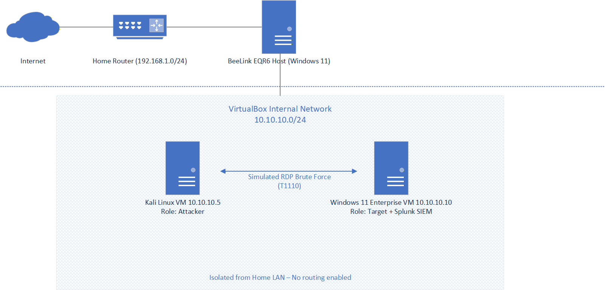
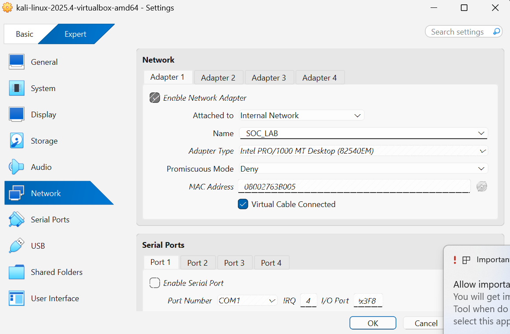
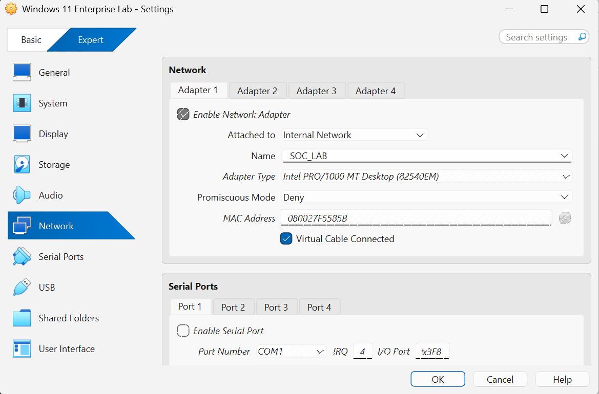
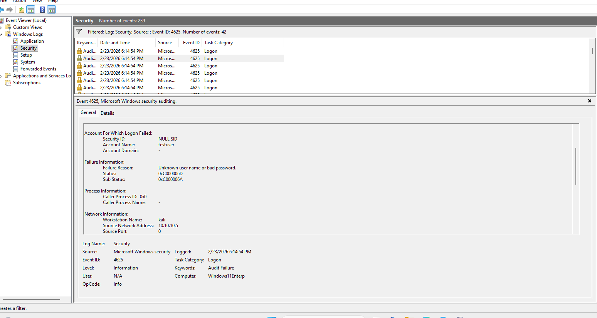
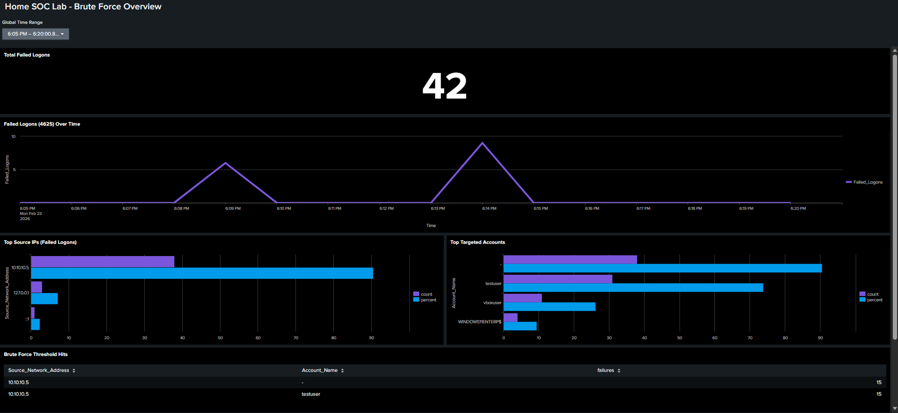

# Home SOC Lab - Detecting Brute Force Attacks Using Splunk

#### **Project Overview**

This project simulates a brute-force attack in an isolated home SOC lab environment and demonstrates its detection using Windows Security logs ingested into Splunk.

#### **Project Objectives:**

* Build a segmented virtual lab environment
* Simulate a credential brute force attack
* Ingest Windows Security logs into an SIEM (Splunk)
* Develop detection logic based on patterns of failed authentication attempts
* Map detection to the MITRE ATT\&CK framework

#### **Lab Architecture**

## Lab Architecture

Network Segmentation

Production Network (Home LAN):

Not involved in attack simulation

No routing between the lab and the home network

SOC Lab Network (VirtualBox Internal Network):

Subnet: 10.10.10.0/24

|**System**|**Role**|**IP Address**|
|-|-|-|
|Kali Linux VM|Attacker|10.10.10.5|
|Windows 11 Enterprise VM|Target + Splunk SIEM|10.10.10.10|

## VirtualBox Network Isolation

##### **Windows Logging Configuration**

These Advanced Audit Policies were enabled using Windows Local Security Policies (secpol.msc):

Logon/Logoff

* Audit Logon (Success/Failure)
* Audit Account Lockout (Success/Failure)
* Audit Other Logon/Logoff Events (Success/Failure)

Account Logon

* Audit Credential Validation (Success/Failure)

Relevant Event IDs

|**Event ID**|**Description**|
|-|-|
|4625|Failed logon attempt|
|4624|Successful logon|
|4740|Account Lockout|
|4776|NTLM authentication attempt|

To verify event logging, I attempted to log in with incorrect credentials and confirmed that Event ID 4625 entries were generated in Event Viewer.

## Evidence – Event ID 4625

#### **SIEM Configuration (Splunk)**

Splunk Enterprise (free trial) is installed locally on the Windows 11 Enterprise VM.

Data Ingestion Method:

Settings —> Add Data —> Monitor —> Local Event Logs —> Security

Index Created:

wineventlog

To verify that the event logs were configured correctly and usable in Splunk, I used the following query:

index=wineventlog

This query confirmed Windows Security events were continuously indexed and accessible in Splunk.

#### **Attack Simulation**

Technique: RDP Brute Force

Tool: Hydra

Command executed in kali: hydra -l testuser -P passwords.txt rdp://10.10.10.10

(testuser, as the name suggests, is a user account on the Windows VM for tests, and passwords.txt is a simple list of passwords I made)

Result: Multiple failed authentication attempts (Event ID 4625) originating from 10.10.10.5.

#### **Detection Engineering**

Basic SPL query for failed logins: index=wineventlog EventCode=4625

A more advanced query that flags brute-force attacks can use a threshold for the number of login attempts from a single IP address.

For example: index=wineventlog EventCode=4625

| stats count by Source\_Network\_Address, Account\_Name

| where count > 5

| sort -count

This query detects more than 5 failed logins from a single IP, helping filter benign traffic from attacks.

Within environments with many users, it's likely that most have entered their credentials incorrectly more than 5 times, especially if the log spans a long period. To improve accuracy, we can also factor in the frequency of these logins to distinguish brute-force attacks from normal network events.

For example: index= wineventlog EventCode=4625

| bin \_time span=1m

| stats count by \_time, Source\_Network\_Address, Account\_Name

| where count > 5

This query detects when more than 5 incorrect login attempts occur within 1 minute, which is much more accurate for brute-force attacks and much more likely to yield a true positive.

With detection logic detailed, it is important to map the findings to the MITRE ATT\&CK framework and note key observations from the SOC analysis.

During the attack: Multiple 4625 events from 10.10.10.5. No successful logins observed. This pattern matches brute force behavior.

In a production environment, repeated authentication failures from a single source are typically classified as a medium-severity alert. However, if these failures are followed by a successful authentication (Event ID 4624), the severity is elevated to high due to potential account compromise.

#### **Dashboard Visualization**

## Splunk Dashboard

SOC monitoring dashboard visualizing brute force activity within the isolated lab network.

#### **Lessons Learned**

* Network segmentation is critical when building attack labs to ensure the environment is safely isolated and poses no threat to the wider network.

* Windows Enterprise provides the granular audit control necessary to conduct realistic SOC simulations.

* A well-designed Splunk index improves detection clarity.

* Threshold-based detection reduces false positives.

#### 

